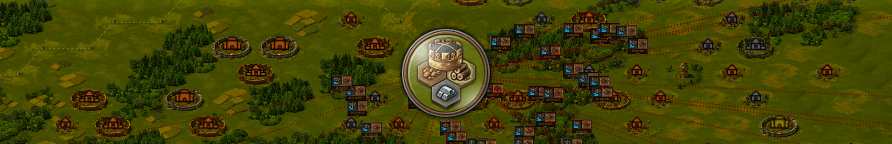

<div align="center">
  <h1>Tribal Wars 2 Overflow - Automating the boring stuff.</h1>
  

  <h4>
    <a href="https://gitlab.com/relaxeaza/twoverflow/-/issues">Submit an Issue</a>
    ·
    <a href="https://www.paypal.com/donate?business=46BYHNZV4GGWN&item_name=TW2Overflow+Development+&currency_code=BRL">Donate</a>
    ·
    <a href="#Contributing">Contributing</a>
    ·
    <a href="https://crowdin.com/project/twoverflow">Translations</a>
  </h4>

  
  
</div>

## Current modules

<dl>
  <dt>FarmOverflow</dt>
  <dd>Highly configurable automatic farmer.</dd>

  <dt>CommandQueue</dt>
  <dd>Automatic command sender with options to specify the date it should arrive or leave village.</dd>

  <dt>AutoCollector</dt>
  <dd>Automatically collect deposit and build the initial second village.</dd>

  <dt>Minimap</dt>
  <dd>Better world map visibility.</dd>

  <dt>BuilderQueue</dt>
  <dd>Automatically build villages using custom sequences of buildings.</dd>

  <dt>AttackView</dt>
  <dd>Better overview of incoming commands.</dd>

  <dt>AutoMinter</dt>
  <dd>Automatically mint coins periodically.</dd>

  <dt>AutoSpyRecruiter</dt>
  <dd>Automatically recruit spies periodically.</dd>
</dl>

## Donate

If you want to support this project, you can donate via [PayPal](https://www.paypal.com/donate?business=46BYHNZV4GGWN&item_name=TW2Overflow+Development+&currency_code=BRL).

## Installation

**Firefox Extension**<br/>
https://addons.mozilla.org/en-US/firefox/addon/tw2overflow/<br/>
<small>Firefox is recommended if you want the script to keep working while the game is kept in second plan.</small>

**Chrome Extension**<br/>
https://chrome.google.com/webstore/detail/tw2overflow/ldblmmabeclbplhbniokpnpaojcaekif

**Userscript**<br/>
https://relaxeaza.gitlab.io/twoverflow/tw2overflow.user.js<br/>
<small>_I recommend using [Violentmonkey](https://github.com/violentmonkey/violentmonkey) to load userscripts as it's open-source and [doesn't collect user data](https://github.com/violentmonkey/violentmonkey/issues/602)._</small>

## Translations

https://crowdin.com/project/twoverflow

Crowdin gave us space to translate our script for free! So help to translate it to your native language.<br/>
Languages tranlated at least \~50% gets merged into the script. At the moment we have German, Portuguese, Polish and Russian.

## Contributing

### Code Quality

TW2Overflow uses [ESLint](https://eslint.org/) to keep the code consistent. Please use it before making pull requests.<br/>
You can check the rules enforced [here](.eslint).

### Build

You'll need to install [nodejs](https://nodejs.org/en/download/) to build the script from source.

Clone the repository and install the dependencies.

```bash
git clone https://gitlab.com/relaxeaza/twoverflow.git
cd twoverflow
npm install
```

To compile run `node make.js`. The script will be compiled inside `dist/`

### Build Flags

You can use some flags to customize the resulting file.

- `--minify` to generate a minified file.
- `--ignore` to ignore specific modules by ID (check _module.json_ for ID).
- `--only` compile only a specific module by ID (check _module.json_ for ID).
- `--lint` check source for errors.
- `--extension` generate a WebExtension package.
- `--userscript` generate a userscript file.

Example: `node make.js --ignore=farm_overflow,minimap --minify` ignores both modules farm_overflow and minimap and will generate a minified file.

### Custom Modules

I recommend you to first understand the structure of an indivudual module [here](https://gitlab.com/relaxeaza/twoverflow/-/wikis/Custom-modules).<br/>
The best way to create your own module is copying a existing, simple module like [auto_minter](/src/modules/auto_minter/) or [auto_collector](/src/modules/auto_collector/).

Translation strings are kept on a separated directory [here](/src/i18n). Create a file with the same `id` of your module on the source language `en_us` directory.
